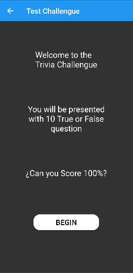
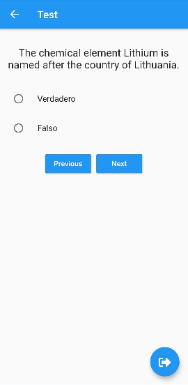
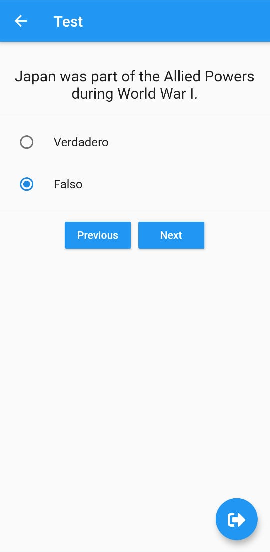
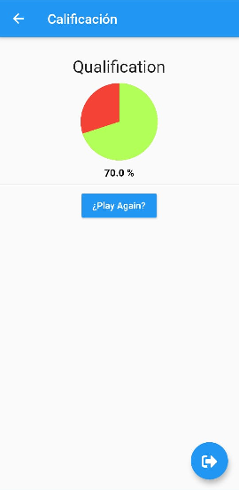

# Test App

App developed in Flutter. Contains a Test that get data for Rest service.

## Getting Started

This project is a starting point for a Flutter application.

A few resources to get you started if this is your first Flutter project:

- [Lab: Write your first Flutter app](https://flutter.dev/docs/get-started/codelab)
- [Cookbook: Useful Flutter samples](https://flutter.dev/docs/cookbook)

For help getting started with Flutter, view our
[online documentation](https://flutter.dev/docs), which offers tutorials,
samples, guidance on mobile development, and a full API reference.

## Home Page

In this page you find the information app and the button for init test.

## Test Page

The test contains 10 question, you response option is true or false.

 

## Qualification Page

Your answers is evaluated and generate your qualification. You can start a new test if you want.

